# 📸 Project Screenshots

Quick view of all project images and screenshots.

## 🖼️ Image Gallery

### Image 1
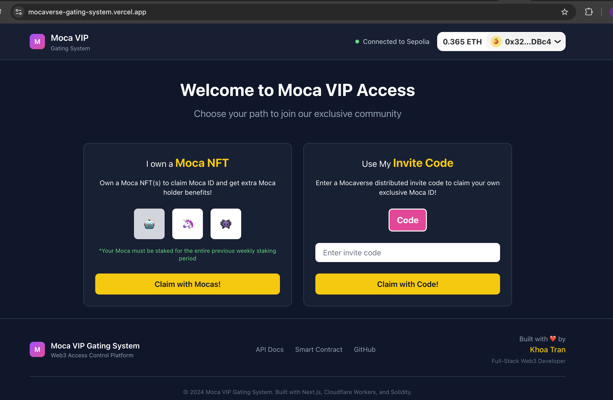

### Image 2
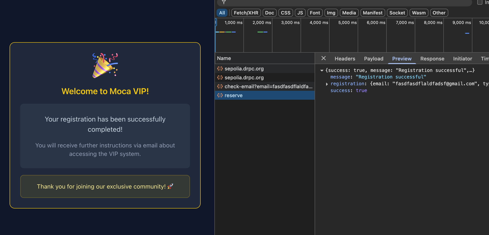

### Image 3
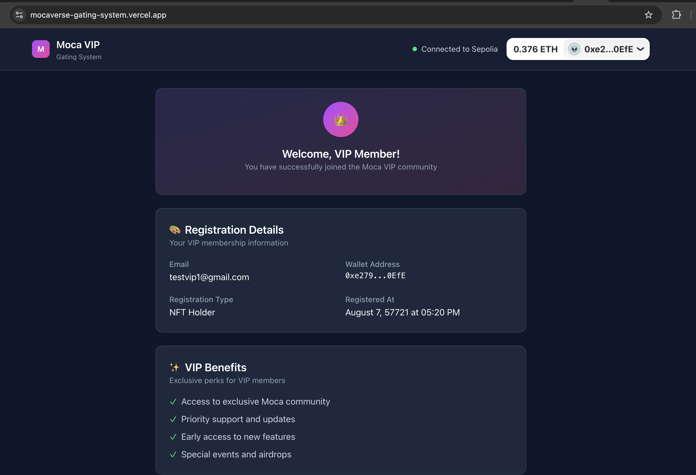

### Image 4
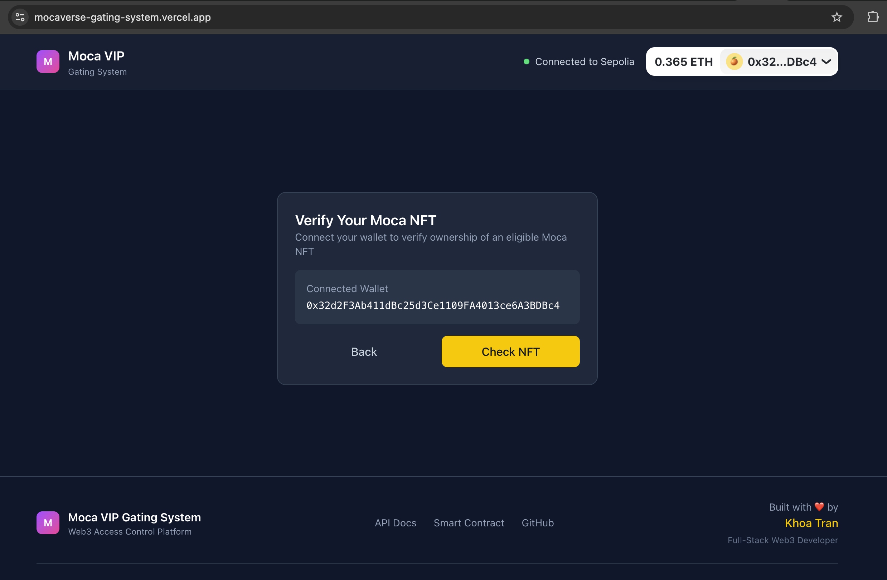

### Image 5
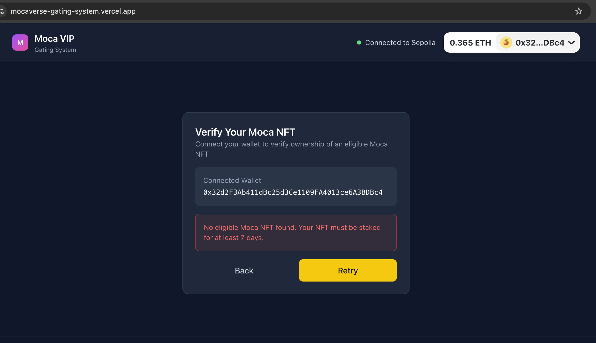

### Image 6
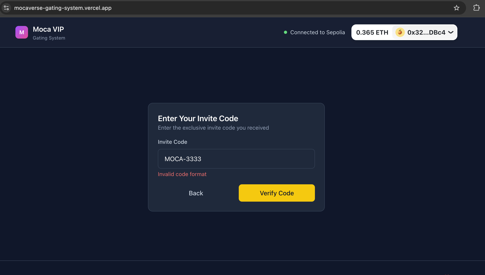

### Image 7
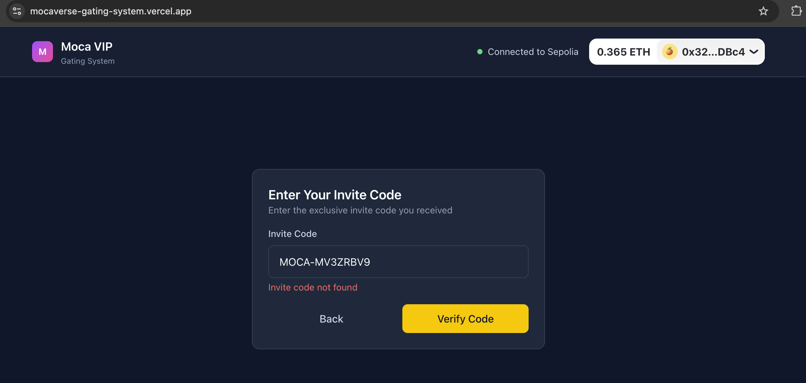

### Image 8
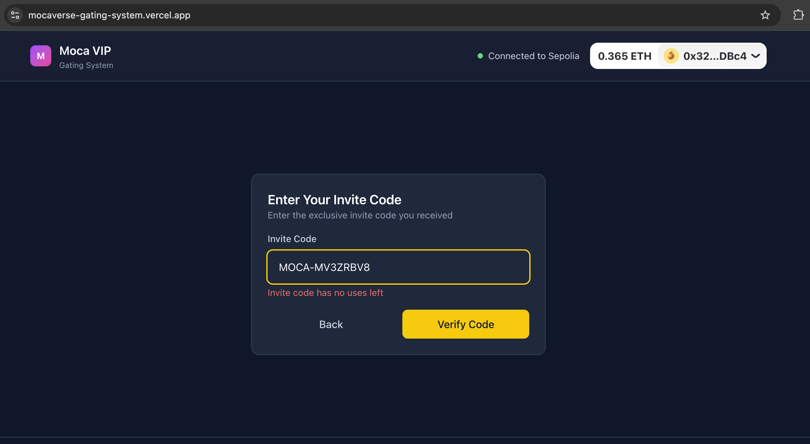

### Image 9
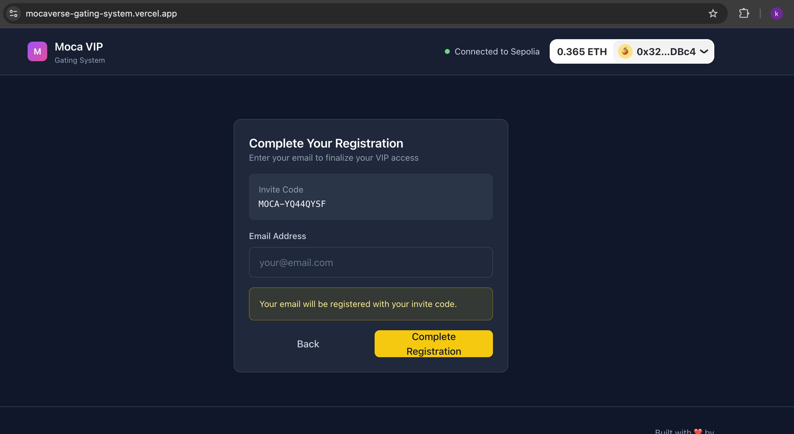

### Image 10
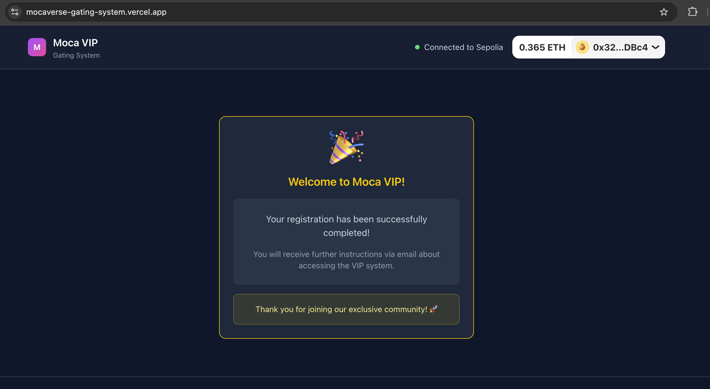

### Image 11 - Swagger API Docs
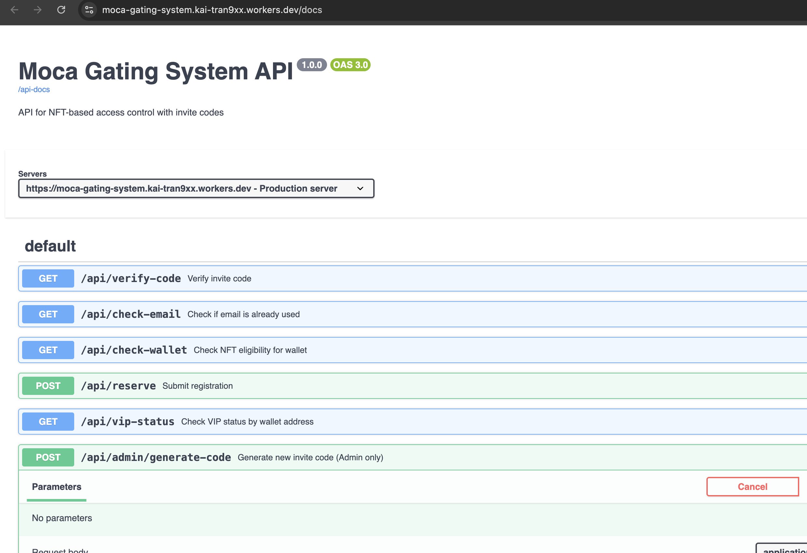

### Image 12 - Swagger API Endpoints
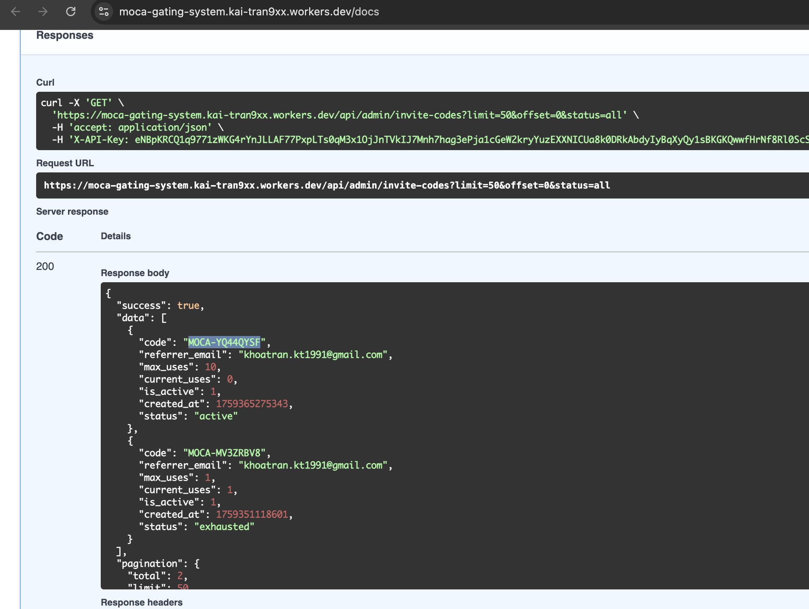

---

## 📝 Notes

- All images are stored in the `docs/imgs/` directory
- Images are optimized for web viewing
- Use relative paths for local viewing
- For production, consider using absolute URLs

## 🔗 Quick Links

- [Back to Main Docs](../README.md)
- [API Documentation](../API.md)
- [Architecture Guide](../ARCHITECTURE.md)
- [Deployment Guide](../DEPLOYMENT.md)
